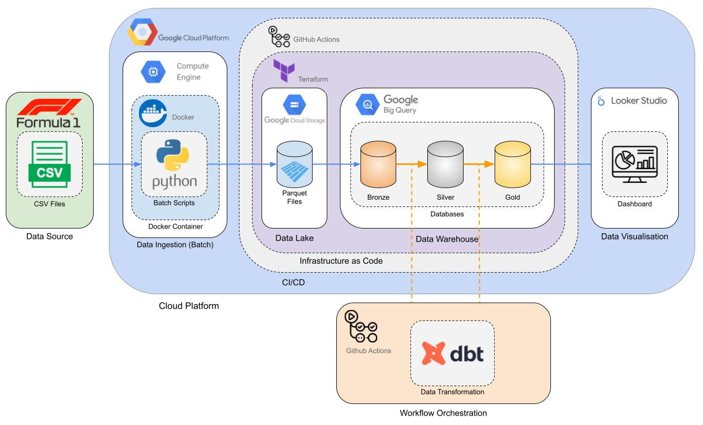
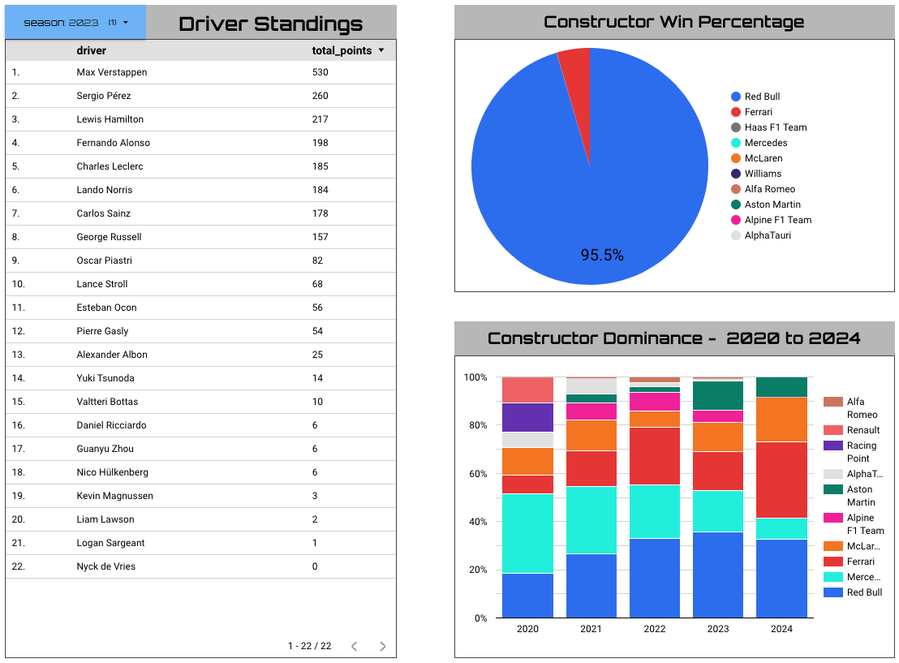

# Formula One Analytics
This repository contains an end-to-end data pipeline for ingesting, transforming, and visualising formula one data.

# Problem description
- 0 points: Problem is not described
- 2 points: Problem is described but shortly or not clearly
- 4 points: Problem is well described and it's clear what the problem the project solves

## Cloud
The main cloud platform used for this project is Google Cloud Platform.

There are several services utilized, including:
- Compute Engine
- Google Cloud Storage
- Google BigQuery

Google Cloud Storage and Google BigQuery resources are deployed with infrastructure as code, using Terraform.

The code for deploying these resources can be found in [infrastructure](./infrastructure).

Note: Staging and production infrastructure is deployed using GitHub actions as a CI/CD tool.

## Data ingestion (Batch)
Batch / Workflow orchestration
- 0 points: No workflow orchestration
- 2 points: Partial workflow orchestration: some steps are orchestrated, some run manually
- 4 points: End-to-end pipeline: multiple steps in the DAG, uploading data to data lake

## Data warehouse
Google BigQuery has been used for the data warehouse tool in this project.

The data is arranged using [Medallion Architecture](https://www.databricks.com/glossary/medallion-architecture) where each stage of data transformation has improved data quality.

The transformations of this data is done by using dbt.

#### Partitioning
Tables are also partitioned to improve their performance. For example, the "F1 Driver Standings" table is partitioned by race season, as shown in the model config of [f1_driver_standings.sql](./transformations/gold/models/marts/f1_driver_standings.sql).

Race season was selected for partitioning as the dashboard utilizes filters which filter on race season, hence less data is queried if the table is partitioned this way.

## Transformations (dbt, spark, etc)
The tool used for transformation of data in this project is dbt.

This tool allows all code to be version controlled, and transformations to be done sequentially.

Data transformations done by dbt are performed using GitHub actions as a CI/CD tool.

This allows dbt to perform transformations in staging and productions environments when changes are made to the code and pushed to the main branch.

## Dashboard
For data visualization, Google Looker Studio has been used.

This allows easy integration with the Google Cloud Platform ecosystem

The dashboard has three tiles:
- Driver standings
- Constructor Win Percentage
- Constructor Dominance - 2020 to 2024

The first two tiles can be filtered by race season.

## Reproducibility
Due to this project being run on a personal cloud account, it can be difficult to reproduce.

If you have your own Google Cloud Platform account, it could be possible to reproduce this project.

#### Clone Repository
The first step is to clone this repository. Having your own repository will allow you to set your own GCP credentials in order to run the project.

#### GitHub Actions - Secrets Manager
In order to allow GitHub actions to perform changes on your GCP account, you must add your service account as a secret to the repository.

Instructions on how to add secrets to your GitHub repository can be found [here](https://docs.github.com/en/actions/security-guides/using-secrets-in-github-actions).

#### Setting GCP Project
You must specify your own GCP project name in the following code:
- [dbt-transform-prod.yml](./.github/workflows/dbt-transform-prod.yml)
- [dbt-transform-staging.yml](./.github/workflows/dbt-transform-staging.yml)
- [prod/_variables.tf](./infrastructure/prod/_variables.tf)
- [staging/_variables.tf](./infrastructure/staging/_variables.tf)
- [dev/_variables.tf](./infrastructure/dev/_variables.tf)
- (data_ingestion/load_f1_data.py)[data_ingestion/load_f1_data.py]

#### GCS Bucket Name
In order to specifiy which bucket the project will use as a data lake, you must set your own bucket name in the following code:
- [data_ingestion/Dockerfile](./data_ingestion/Dockerfile)
- [prod/_variables.tf](./infrastructure/prod/_variables.tf)
- [staging/_variables.tf](./infrastructure/staging/_variables.tf)
- [dev/_variables.tf](./infrastructure/dev/_variables.tf)

